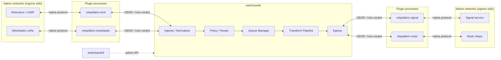

# Architecture

RelayFabric is a protocol-independent communications routing fabric: a headless Rust daemon, `switchyardd`, that routes canonical messages between out-of-process protocol plugins according to policy, while a CLI, `switchyardctl`, drives it through an administrative API. The daemon never speaks a native protocol itself — every network-specific concern (Reticulum/LXMF, Signal, Meshtastic, MeshCore, Bitchat, Nostr, MQTT, and future adapters) lives in a plugin process, and the daemon only ever handles a single internal representation of a message.

## Design principles

The architecture follows directly from a small set of principles (SPEC §4). Every routing, capability, and IPC decision described below exists to satisfy one of these.

### Route messages, not identities

`switchyardd` does not assume `Signal user A == Meshtastic user A == LXMF user A`. Protocol identities remain independent unless an operator or user explicitly links them. The router's job is moving a message from one endpoint to another — not building a cross-network identity graph.

### Protocol independence

The core contains no protocol-specific routing logic. Everything that knows about LXMF destination hashes, Signal UUIDs, or Meshtastic node IDs lives in a plugin. `switchyardd` only understands the canonical envelope.

### Least information disclosure

RelayFabric discloses only the information required to route and represent a message on the destination network. Native identifiers do not automatically cross protocol boundaries — a Meshtastic node ID is not exposed to a Signal recipient just because both plugins happen to be enabled.

### Explicit trust boundaries

RelayFabric distinguishes transport encryption, gateway-visible plaintext, signed messages, and application-level end-to-end encrypted messages. Operators and users must be able to determine when a gateway can actually read content — this is what the [security modes](security.md) exist to make explicit rather than implicit.

### Store-and-forward first

Networks may be intermittent, slow, partitioned, offline, or high-latency. Persistent queues are a core daemon capability, not an add-on bolted onto an otherwise synchronous router.

### Capability-aware routing

The router never assumes every destination supports every feature. A Signal attachment routed toward Meshtastic does not attempt to push several megabytes over LoRa — it degrades, per policy, to something like `[attachment omitted]`. This is the job of the [transform pipeline](#transform-pipeline).

### Failure isolation

A crashed Signal plugin must not take down Reticulum, MeshCore, or any other adapter. Plugins therefore run out-of-process by default, supervised independently by the daemon.

!!! note "Where these live in the spec"
    Design principles are SPEC §4.1–4.7. The architectural pieces that implement them are covered section by section below; see [`docs/SPEC.md`](SPEC.md) for the normative text.

## Runtime shape

A RelayFabric deployment is one `switchyardd` process, zero or more plugin processes (one per configured protocol), and `switchyardctl` invoked as needed for administration. Nothing else is required to run.



Plugins are symmetric — the diagram splits ingress/egress plugin groups only to show data flow for one hop; in practice every plugin can both receive from and send to `switchyardd` over the same socket connection (SPEC §5, §9).

### `switchyardd`

The daemon (SPEC §6.1) owns:

* plugin lifecycle (spawn, supervise, restart)
* message normalization into the canonical envelope
* routing and policy evaluation
* identity aliasing
* deduplication
* persistent queueing
* transformation for destination capabilities
* security policy
* provenance tracking
* message TTL enforcement
* rate limiting
* health monitoring and auditing
* configuration
* the administrative API

`switchyardd` should not directly implement any individual external protocol. That boundary is what keeps the core protocol-independent (SPEC §4.2, §6.1).

Internally, a message moves through five stages (SPEC §5): **Ingress → Normalizer → Policy/Router → Queue Manager → Transform → Egress**. Ingress and normalization convert a plugin-reported message into a canonical envelope; the policy/router stage decides which routes and destinations apply; the queue manager holds anything that cannot be delivered immediately; the transform stage adapts the message per destination capability just before egress hands it back to a plugin.

### Plugin processes

Plugins are separate OS processes, one per protocol, following the naming convention `relayfabric-<protocol>` (e.g. `relayfabric-lxmf`, `relayfabric-signal`, `relayfabric-meshtastic`). Each plugin owns everything protocol-specific: talking to `signal-cli`, a Meshtastic radio, an LXMF/Reticulum stack, an MQTT broker, and so on. See [Plugins](plugins.md) for the supported backend styles and the preference order for integrating a new network (native API first, reverse-engineered protocol only as a last resort — SPEC §7).

### `switchyardctl`

The administrative CLI. It talks to `switchyardd`'s admin API rather than embedding any routing logic itself. Representative commands (SPEC §6.3):

```bash
switchyardctl status
switchyardctl plugins
switchyardctl routes
switchyardctl peers
switchyardctl queue
switchyardctl identities
switchyardctl policy test
switchyardctl message trace
```

## Plugin IPC

Plugins run out-of-process and communicate with `switchyardd` over a Unix domain socket for local deployments (SPEC §9). The protocol is intentionally simple, versioned, and language-neutral so plugins can be written in whatever language best suits their backend.

CBOR is the preferred encoding for constrained deployments; MessagePack and protobuf were considered as alternative candidate encodings.

!!! note "Deferred transports"
    TCP, QUIC, gRPC, and authenticated remote plugin connections are called out in the spec as optional *later* transports (SPEC §9) — the initial IPC target is the local Unix socket only.

Conceptually, a plugin implements a small async interface toward the daemon (SPEC §10):

```rust
trait RelayPlugin {
    fn descriptor() -> PluginDescriptor;

    async fn start() -> Result<()>;

    async fn health() -> HealthStatus;

    async fn send(
        endpoint: Endpoint,
        message: GatewayMessage
    ) -> Result<DeliveryResult>;

    async fn shutdown() -> Result<()>;
}
```

Plugins asynchronously emit received messages to `switchyardd` as they arrive from the native network — the relationship is not strictly request/response.

## Canonical message envelope

Every inbound message is converted into a RelayFabric envelope before routing (SPEC §12). This envelope, not any native protocol structure, is what the router, policy engine, queue, and transform pipeline operate on.

```json
{
  "version": 1,
  "id": "01K2RF...",
  "source": {
    "protocol": "meshtastic",
    "instance": "pasadena-01",
    "endpoint": "channel:0"
  },
  "sender": {
    "native_ref": "opaque",
    "alias": "MESH-7F21"
  },
  "type": "text",
  "body": "Testing from Pasadena",
  "created_at": "2026-08-15T08:32:10Z",
  "received_at": "2026-08-15T08:32:12Z",
  "expires_at": "2026-08-16T08:32:10Z",
  "reply_to": null,
  "attachments": [],
  "security": {},
  "provenance": [],
  "native": {}
}
```

| Field | Purpose |
|---|---|
| `version` | Envelope schema version |
| `id` | Internal message ID (see [Message IDs](#message-ids)) |
| `source` | Protocol, plugin instance, and native endpoint the message arrived on |
| `sender` | Opaque native reference plus a privacy-preserving alias — never the raw native identity by default |
| `type` | One of the [message types](#message-types) |
| `body` | Primary content, if any |
| `created_at` | Timestamp assigned by the origin network, if known |
| `received_at` | Timestamp assigned by the ingesting plugin/daemon |
| `expires_at` | TTL boundary; expired messages are not delivered |
| `reply_to` | Message ID this message replies to, if applicable |
| `attachments` | Attachment metadata, represented separately from `body` |
| `security` | Content-security mode metadata for this message |
| `provenance` | Route/gateway hop history |
| `native` | Protocol-specific metadata (see [Native metadata](#native-metadata)) |

### Message IDs

`switchyardd` assigns a globally unique internal message ID to every message — UUIDv7 preferred, ULID acceptable (SPEC §13). This internal ID must remain stable as the message passes through RelayFabric, regardless of how many networks or gateways it transits. Protocol-native IDs are additionally retained inside the gateway trust boundary, but the fabric-internal ID is what dedup, provenance, and tracing key on.

### Message types

The canonical envelope's `type` field draws from an initial fixed set (SPEC §14):

| Type | Description |
|---|---|
| `text` | Plain text content |
| `notice` | System or informational notice |
| `location` | Position/location data |
| `telemetry` | Sensor or status telemetry |
| `command` | Administrative or control command |
| `attachment` | File or media attachment |
| `reaction` | Reaction to a prior message |
| `receipt` | Delivery or read receipt |
| `presence` | Presence/online status |

Plugins may advertise additional native message types beyond this set. Unknown types must not cause router failure — the router treats an unrecognized type as opaque data to route, not a fatal condition.

### Native metadata

Protocol-specific information that doesn't fit the canonical fields may be retained under the envelope's `native` object (SPEC §15). For example, an LXMF-originated message might carry:

```json
{
  "native": {
    "rssi": -104,
    "snr": 7.2,
    "signature_valid": true
  }
}
```

Native metadata is **not** automatically forwarded across a route. Policy determines which, if any, native metadata fields may cross a boundary — this is the same least-information-disclosure principle applied field by field.

## Capability model

Every plugin advertises what it supports via its `Hello` message at connection time (SPEC §16, and the IPC lifecycle in [Plugins](plugins.md)). The router uses this to decide what a destination can actually receive before attempting delivery.

```rust
struct Capabilities {
    text: bool,
    direct_messages: bool,
    groups: bool,
    attachments: bool,
    location: bool,
    reactions: bool,
    receipts: bool,
    presence: bool,
    max_payload: Option<u64>,
}
```

| Capability | Meaning |
|---|---|
| `text` | Plugin can send/receive text messages |
| `direct_messages` | Plugin supports addressing a native ref directly, not just a configured endpoint |
| `groups` | Plugin supports group/channel destinations |
| `attachments` | Plugin can carry file/media attachments |
| `location` | Plugin can carry location data |
| `reactions` | Plugin supports message reactions |
| `receipts` | Plugin can report delivery/read receipts |
| `presence` | Plugin supports presence information |
| `max_payload` | Maximum payload size the plugin's network can carry, if bounded |

A plugin descriptor combines these capabilities with plugin identity and protocol version (SPEC §11), for example a Meshtastic plugin reporting `text`, `direct_messages`, `groups`, and `location` support with `max_payload: 237` and no attachment support.

## Transform pipeline

Before a message is handed to an egress plugin, it passes through a transform stage that reconciles the canonical message against the destination's advertised capabilities and the applicable policy (SPEC §17):

```text
canonical message
       │
       ▼
destination capabilities
       │
       ▼
policy
       │
       ▼
transform
       │
       ▼
protocol adapter
```

This is where capability-aware routing (SPEC §4.6) is actually enforced. A Signal message with a photo attachment routed toward Meshtastic does not get resized and forced onto LoRa — policy and the destination's `attachments: false` / `max_payload` capability combine to produce a degraded result instead:

```text
[SIG-A921]
Look at this
[attachment omitted]
```

The same pipeline stage is responsible for any other capability-driven adaptation: truncating to `max_payload`, stripping location data, or reformatting a reply chain for a plugin that has no native reply concept. See [Transport Classes](transport-classes.md) for how constrained links factor into this decision, and [Routing & Policy](routing.md) for how policy rules select the transform to apply.

!!! warning "Sealed routing is out of scope for the transform pipeline"
    SPEC §113's *sealed* security mode — payload end-to-end encrypted between gateways, untransformable by the fabric — **shipped in v0.3 (phase 1, gateway-to-gateway)**; see [Security & Sealed Routing](security.md). Sealed routes are structurally exempt from this transform pipeline: no downscaling, no truncation, no attachment stripping. The pipeline described here applies to `native`/`gateway` mode messages, where the gateway can read and adapt plaintext.

## See also

* [Plugins](plugins.md) — supported backend styles, the plugin descriptor, and IPC lifecycle detail
* [Routing & Policy](routing.md) — how routes are matched and policy actions are selected
* [Configuration](configuration.md) — daemon and plugin configuration format
* [Transport Classes](transport-classes.md) — bandwidth-class-aware egress behavior
