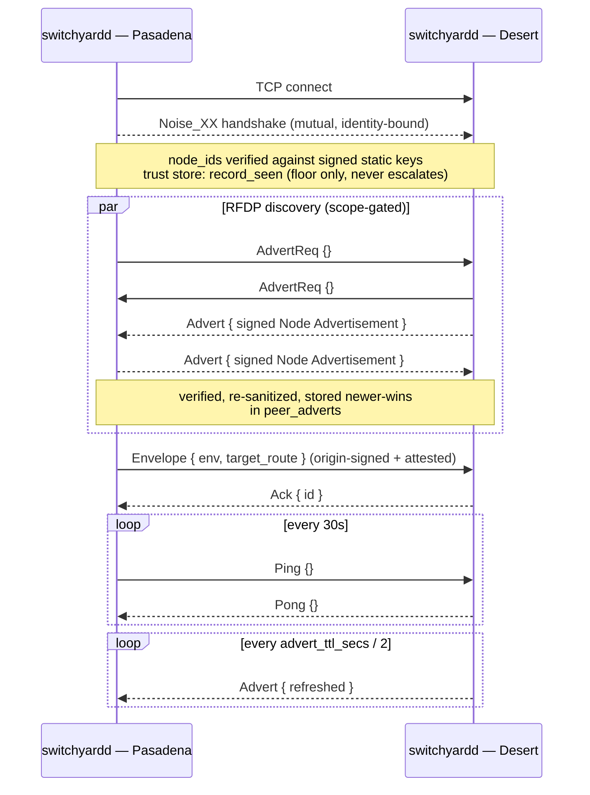

# Federation & Discovery

Federation lets independent `switchyardd` gateways interconnect directly, `switchyardd`-to-`switchyardd`, over an authenticated encrypted link — without routing through a shared native network. A locally-originated envelope is signed by its origin gateway and gains a verifiable attestation at every hop it federates through; RFDP (RelayFabric Discovery Protocol) rides the same links to let peers learn what services and protocols a gateway actually offers, without leaking the infrastructure behind it. Both are opt-in: a `switchyardd` with no `federation:` block never dials out, never listens, and never advertises anything.

!!! info "Implementation status"
    This page documents what v0.3 actually ships: `Noise_XX` links, signed envelopes with attestation chains, a persistent trust store, `fed:` route egress, RFDP advert exchange (`disabled`/`federation`/`public` scopes), and `GET /v1/discovery`. RFDP's `local` scope (SPEC §111.5) is specced but **deferred** — no LAN transport exists yet, and config validation rejects it explicitly rather than silently accepting a scope that can't work. Federated attachments are **metadata-only** this cycle — see [What federation does not carry](#what-federation-does-not-carry-yet-attachment-bytes).

## How a federation link comes up

Two gateways federate over plain TCP, secured end-to-end by `Noise_XX_25519_ChaChaPoly_BLAKE2s`. `XX` means both sides authenticate — there's no pre-shared identity requirement to *start* a handshake, but the handshake result is only useful once the identity binding is checked.

Each node persists a stable X25519 static keypair (`<data_dir>/fed_static.key`, `0600`), independent of its long-term Ed25519 node identity (`<data_dir>/identity/node.key`, presented as `rf:<64 hex chars>`). The identity binding happens in the handshake's final message: each side signs its own freshly-transmitted X25519 static public key with its Ed25519 node identity, domain-separated (`relayfabric-noise-static-v1:` prefix) so this signature can never be confused with any other signature this codebase produces (an envelope's origin signature, an attestation link, an advert signature — each has its own domain). The receiver checks the claimed `node_id` against that signature before trusting the peer at all; a mismatch tears the connection down as `IdentityMismatch`.

Once the handshake completes:

- The connection is recorded in the trust store at level `seen` if this is the first time this `node_id` has ever connected (`record_seen` — an `INSERT OR IGNORE`, so it never lowers or overwrites an existing higher level).
- A 30-second keepalive (`Ping`/`Pong`) and a 90-second dead timer keep the link's liveness authoritative — a stalled peer is torn down within one dead-timer window, not left as a zombie task.
- The Noise transport keys rekey every 8 hours.
- Each side sends `AdvertReq` (if RFDP discovery scope allows it for this peer) to ask for the other's current advert.



## Trust ladder

Every known federation node has exactly one row in a persistent `node_trust` store (`(node_id, level, first_seen, updated_at)`). Trust is a total order (SPEC §112.7):

| Level | Rank | Meaning | Set by |
|---|---|---|---|
| `blocked` | 0 | Handshake refused outright. **Sticky** — a node removed from `federation.blocked[]` but not re-added anywhere else stays blocked; nothing in the wire protocol can clear it. | `federation.blocked[]` (config only) |
| *(unknown)* | 1 | No row in the store at all — never actually persisted as a value. | — |
| `seen` | 2 | Completed a Noise handshake. A **floor**: discovery and handshake activity can create this row, but can never raise an existing row past it. | `record_seen`, on first successful handshake |
| `verified` | 3 | Config-asserted default trust for a listed peer. | `federation.peers[].trust` (default when a peer entry has no explicit `trust`) |
| `trusted` | 4 | Highest tier — explicit operator elevation, independent of any `peers[]` entry. | `federation.peers[].trust: trusted`, `federation.trusted[]` |

Three invariants hold everywhere this ladder is consulted:

1. **A handshake never escalates trust.** `record_seen` only ever inserts a fresh `seen` row (`INSERT OR IGNORE`) — it can never touch an existing `verified`/`trusted`/`blocked` row.
2. **Config reseed is authoritative, every boot.** `federation.peers[]`/`trusted`/`blocked` are re-applied on every daemon start, in that order, with `blocked` applied last so a node listed as a trusted peer *and* blocked ends up blocked — the most restrictive outcome wins. A node previously `verified`/`trusted` by a config that no longer lists it is downgraded to `seen` (its row is kept, not deleted); `first_seen` is preserved across reseeds — only `updated_at` advances.
3. **Blocked is sticky.** Nothing at runtime — not a handshake, not an advert, not a config edit that simply omits the node — clears a `blocked` row. Only an explicit config change that seeds a *different* level for that `node_id` can move it off `blocked`.

`federation.accept_from` (default `verified`) is the gate `fed_ingress` applies to an inbound envelope: the signer's current trust rank must be `>=` `trust_rank(accept_from)`, or the envelope is dead-lettered `BAD_SIGNATURE`/rejected before any routing decision is made.

## Signed envelopes and attestation chains

A federation-eligible envelope carries an `origin` signature and zero or more `attestations`, each a verifiable link in a provenance chain (SPEC §32–33):

- **Origin signature** (`sign_origin`): the gateway that first federates a locally-originated envelope signs its canonical bytes — `[id, source.protocol, source.endpoint, sender.native_ref, kind, body, created_at, sorted per-attachment (sha256, filename, mime, size)]` — with its own Ed25519 node identity, domain-separated with `relayfabric-envelope-v1:`. `priority` is deliberately excluded: it's not signed, and a remote peer's claimed priority is stripped/ignored entirely on ingress.
- **Attestation chain** (`append_attestation`): every gateway that forwards the envelope — including the origin, on its first hop — appends a link signing `digest(canonical) || prev_sig || timestamp` (domain `relayfabric-attest-v1:`), chained to the previous link's signature. A receiver walks the whole chain (`verify_chain`) before accepting the envelope; any broken link dead-letters it `BAD_SIGNATURE`.

v0.3 signs at the **origin gateway** only — this is gateway provenance (SPEC §30), not end-user authorship. User-key origin signatures are a v0.4 concern.

!!! note "Attachment metadata is signed; attachment content is not carried here"
    The attachment fields covered by the origin signature are `sha256`/`filename`/`mime`/`size` — no attachment bytes cross the signature or the wire frame this way. See [What federation does not carry yet](#what-federation-does-not-carry-yet-attachment-bytes) below.

## `fed:` route egress

A route whose destination is `fed:<peer_name>/<remote_route>` is delivered by looking up a live connection for `peer_name` (a disconnected peer just means "retry in 5 seconds," same as a down plugin), then:

1. **Egress budget.** `federation.peers[].messages_per_minute` (0 = unlimited) is checked first, keyed `fed/<peer_name>` in the same limiter transport budgets use — a peer fed from many distinct local senders is capped as a whole link, since no individual per-sender limit catches that pattern. Unlike transport-budget egress, there is **no priority bypass**: an emergency-priority envelope queues behind this budget exactly like everything else.
2. **Pseudonymize, then sign — local-origin only.** If the envelope has no `origin` yet (`env.origin.is_none()`, i.e. this daemon originated it), and `federation.identity_exposure` is `pseudonymous` (the default), `sender.native_ref` is replaced with a route-scoped alias *before* signing — so the origin signature covers what the peer will actually see, never the raw local ref. `identity_exposure: full` skips the alias and signs the raw ref instead.
3. **Relay traffic is left untouched.** An envelope that already has an `origin` (this daemon ingressed it from another peer and is now forwarding it onward) is **never** re-pseudonymized or re-signed — mutating `sender.native_ref` on an already-signed envelope would invalidate its origin signature and get it dead-lettered downstream. Only the pass-through gateway's own attestation is appended.
4. **Attest and send.** Every hop — origin or relay — appends its own attestation and increments `hops`, unconditionally, before the frame goes out as `Fed::Envelope { env, target_route }`.

## Replay bounds

Federation ingress cannot trust wall-clock arrival time as a freshness signal — only the envelope's **signed** `created_at` is trustworthy, because it's covered by the origin signature. Ingress applies two independent checks against it:

- **Stale**: `created_at + federation.max_ttl_secs < now` — an old-enough envelope is rejected even if it was never seen before.
- **Far-future**: `created_at > now + 300s` — a clock-skewed or maliciously future-dated envelope is rejected too.

This bounds the replay window to `max_ttl_secs` regardless of in-memory dedup state: dedup alone would let a captured, genuinely-signed envelope be replayed after the dedup window closes or after a daemon restart clears it. The `created_at` bound closes that gap independent of dedup.

## DoS hardening

Federation is reachable by anyone who can open a TCP connection, so the connection layer treats every unauthenticated socket as hostile until proven otherwise:

| Control | Value | What it stops |
|---|---|---|
| Inbound connection cap | 64 concurrent (`Semaphore`, held for the connection's full lifetime, not just its handshake) | A connection-flood attacker exhausting file descriptors/memory before any policy is ever evaluated. A socket over the cap is dropped immediately, before spending any CPU on a Noise handshake. |
| Send timeout | 30s per `send_frame` call | A peer that completes the handshake and then stops reading (zero-window TCP) stalling `write_all` — and with it the same task's own ping/dead-timer/rekey checks — forever. |
| Dead timer | 90s since last received frame | A peer that goes silent without closing the socket. |
| Ping interval | 30s | Keeps the dead timer from tripping on an otherwise-healthy idle link. |

A config knob for the connection cap is deferred; today it's a fixed safety ceiling, not operator-tunable.

## RFDP discovery

RFDP lets a gateway describe *what it can do* — services, protocols, security posture — without describing *how to reach specific people through it*. Discovery reuses live federation links; it never opens a separate channel.

### The Node Advertisement

A Node Advertisement is a signed, expiring capability document, built **only from `Config`** at load time — never from a live plugin handle, a route table, or anything else that could leak operational detail:

```json
{
  "rf_version": 1,
  "node_id": "rf:75bc...",
  "name": "DX.PE Pasadena",
  "services": { "federation": true, "chat": true, "store_forward": true },
  "protocols": {
    "lxmf": { "rx": true, "tx": true, "text": true, "files": false, "max_payload": null }
  },
  "security": {
    "translate": true,
    "signed": true,
    "sealed": true,
    "sealed_key": "33333333...64 hex chars"
  },
  "expires": 1786838400,
  "sig": "..."
}
```

- `services` is the union of every `public_services[].type` — the service *class* (`chat`, `store_forward`, `telemetry`, ...), never a route name — plus `"federation": true` unconditionally.
- `protocols` covers every protocol named in any `public_services[].ingress`/`.egress` list; `text: true`, `files: false`, `max_payload: null` for all of them this cycle — live per-plugin capability enrichment is future work.
- `security.sealed_key` is this node's stable X25519 sealed-routing public key ([Security & Sealed Routing](security.md)).
- `expires` is `now + discovery.advert_ttl_secs`.

The whole document is Ed25519-signed by the node identity named in `node_id`, over a domain-separated (`relayfabric-advert-v1:`) canonical CBOR tuple — never the struct's raw serialization, so a future field addition can't silently join the signed bytes. A peer can't publish a `sealed_key`, a service list, or anything else under another node's identity without forging that node's signature.

!!! warning "What must never appear in an advert"
    SPEC §111.4: no Signal usernames/phone numbers, Meshtastic node IDs, LXMF user identities, device paths, IP addresses/VPN topology, GPS coordinates, identity mappings, or private route names. `build_from_config`'s sourcing rule — config-facts only, nothing live — is what makes this enforceable at the type level rather than by convention.

### Wire frames

All federation traffic — envelopes and discovery alike — moves as CBOR-tagged frames (`t` field) over the same Noise-secured connection:

| Frame (`t`) | Fields | Purpose |
|---|---|---|
| `envelope` | `env`, `target_route` | A routed message, addressed to a local route on the *receiver* named `target_route`. |
| `ack` | `id` | Acknowledges ingress of envelope `id`. |
| `ping` / `pong` | — | Keepalive, 30s interval / 90s dead timer. |
| `advert` | `advert` | This node's current signed Node Advertisement — sent in reply to `advert_req`, or proactively on the refresh timer. |
| `advert_req` | — | "Send me your current advert, if you have one." Sent once per side at connection-up, gated by discovery scope. |
| `sealed` | `sealed`, `target_route` | Sealed-routing egress — an AEAD-sealed payload with a cleartext routing/dedup/expiry header only. See [Security & Sealed Routing](security.md). |
| *(unrecognized `t`)* | — | Decodes to an internal placeholder and is ignored outright — additive versioning, so an older daemon keeps working when a newer peer sends a frame type it doesn't know about yet, instead of tearing the link down. |

### Exchange timing

- **On-connect**: each side sends `advert_req` once, immediately after the handshake completes, gated by `advert_scope_allows` for that specific peer.
- **Periodic refresh**: a live connection proactively re-sends its own `advert` every `advert_ttl_secs / 2`, so a peer's stored copy never sits stale for more than half its TTL.
- A received advert is rejected (and the row left untouched) if it fails signature verification, exceeds a 16 KiB size cap, has a name over 64 characters, or claims an expiry more than 24 hours out — an over-generous TTL claim is clamped down, not treated as fraud on its own.

### The peer-adverts store

Verified adverts are kept in a `peer_adverts` table, keyed by `node_id`:

- **Newer-wins**: `upsert_peer_advert` only replaces an existing row if the incoming advert's `expires` is strictly greater than what's stored — a stale or equal-TTL resend never clobbers a fresher record.
- **Purged hourly**: expired rows are swept on the same hourly cadence as retention/challenge purges. This is disk hygiene, not a correctness gate — `list_peer_adverts` already filters to unexpired rows on every read.

### Scope gating

```yaml
discovery:
  mode: federation
  advert_ttl_secs: 3600
```

| Mode | Behavior | Status |
|---|---|---|
| `disabled` (default) | Advert exchange never happens with any peer — neither sent nor requested. | Implemented |
| `federation` | Exchanged only with peers whose current trust rank meets `federation.accept_from`. Recommended default once discovery is turned on. | Implemented |
| `public` | Exchanged with any peer that completed the Noise handshake, regardless of trust level. | Implemented |
| `local` | LAN / local RNS-neighborhood discovery. | **Deferred** — no LAN transport exists yet; `discovery.mode: local` is rejected at config load rather than silently accepted. |

`advert_ttl_secs` has a 300-second floor — `validate()` rejects anything shorter as a churn/flood footgun.

### Serving `GET /v1/discovery`

```json
{
  "mode": "federation",
  "our_advert": { "...": "this node's own advert, or null if discovery is off" },
  "peers": [
    { "node_id": "rf:...", "name": "Desert", "services": {"...": true}, "protocols": {}, "security": {}, "expires": 1786838400, "received_at": "2026-08-17T12:00:00Z" }
  ]
}
```

`our_advert` is built and signed fresh from the *live* config on every request — the exact function the real fed link calls, so this endpoint can never show a different advert than what peers actually receive. `peers[]` is every stored, unexpired advert, but nothing is served on trust alone:

- Each row is **re-verified** against its own embedded signature before being served, independent of the receive-path verification it already passed once when it was stored — a defense against direct database tampering.
- Each row is checked that its embedded `node_id` **matches the row key it's stored under** — the node-id spoof guard. Without this, a database-write-capable attacker with no victim private key could insert a row keyed to a victim's `node_id` carrying an advert that's validly self-signed under the *attacker's own* keypair; `sig` verification alone would pass that straight through as the victim.
- The served `name` is re-sanitized (control characters and newlines stripped) from the freshly-decoded advert on every request, never trusted from a cached/pre-sanitized value.

A row that fails any of these checks is silently dropped from the response — never served half-trusted — but left in storage; only the hourly purge sweep deletes rows, and only for expiry, not for a failed re-verification.

### Per-peer egress budgets

Beyond the connection cap and send timeouts above, each configured peer has its own aggregate egress budget (`federation.peers[].messages_per_minute`, 0 = unlimited) — see [`fed:` route egress](#fed-route-egress). This is the peer-link-level complement to `limits.per_sender` and `transport_budgets`: it catches a flood spread across many distinct local senders that no individual per-sender limit would trip.

## What federation does not carry yet: attachment bytes

Federated envelopes carry attachment **metadata only** — `sha256`, `filename`, `mime`, `size` — the same fields the origin signature covers. The actual attachment bytes live in this daemon's local content-addressed store (CAS) and are **not** replicated to a federated peer's CAS. A route that spans a federation hop and expects a downstream attachment to be locally deliverable needs that content already reachable on the receiving side (e.g. via a plugin protocol that carries the bytes itself); RelayFabric v0.3 has no CAS blob sync between federated gateways. Treat federated attachment references as advisory metadata until a future cycle adds blob replication.

## Sealed routing composes with federation

Federation links are also the transport sealed routing rides on: a `Fed::Sealed` frame carries an AEAD-encrypted payload (`x25519-xchacha20poly1305-v1`) addressed to a peer's stable `sealed_key` — published in that peer's own advert, or pinned explicitly via `federation.peers[].sealed_key` — with only routing metadata (`id`, `expires_at`, `target_route`) left in the clear. Federation's Noise link, trust store, and attestation chain all still apply underneath; sealing is an additional payload-confidentiality layer on top, not a replacement for any of them. v0.3 sealed routing is phase 1: direct-peer only, no relay-through yet. See [Security & Sealed Routing](security.md) for the full model.

## Configuration reference

```yaml
node:
  data_dir: /var/lib/relayfabric

federation:
  listen: "0.0.0.0:7890"        # omit for outbound-only (no listener bound)
  accept_from: verified          # minimum trust rank required to accept inbound envelopes
  max_hops: 4
  max_ttl_secs: 86400
  identity_exposure: pseudonymous  # or "full"
  ingress_routes: [regional-chat]  # local routes a federated peer may inject into
  peers:
    - name: desert
      node_id: "rf:aaaaaaaa...64 hex chars"
      addr: "desert.example.net:7890"
      trust: verified             # or "trusted"
      messages_per_minute: 120    # 0 = unlimited
      sealed_key: null            # optional pin; otherwise learned from the peer's advert
  trusted: []                    # extra node_ids seeded "trusted" at boot
  blocked: []                    # node_ids refused at handshake — sticky

discovery:
  mode: federation               # disabled | federation | public
  advert_ttl_secs: 3600          # minimum 300
```

See [Configuration](configuration.md) for the full config schema and validation rules, and [Operations](operations.md) for `switchyardctl` federation/discovery inspection commands and the `relayfabric_federation_*`/`relayfabric_advert_*` Prometheus counters.

## See also

- [Security & Sealed Routing](security.md) — content-security modes, sealed routing's threat model and guarantees.
- [Operations](operations.md) — `GET /v1/federation`, `GET /v1/discovery`, metrics, and message tracing across a federated hop.
- [Configuration](configuration.md) — the full `federation`/`discovery`/`privacy` config reference.
