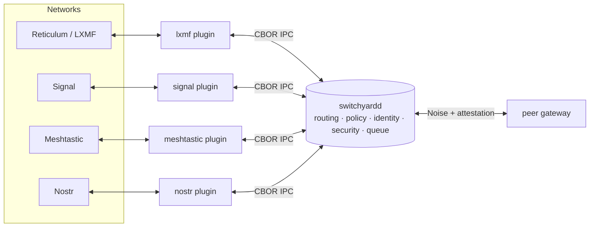

# RelayFabric

**RelayFabric is an open communications routing fabric for interconnecting otherwise incompatible messaging, mesh, radio, and Internet systems.** It provides one common routing, policy, identity, security, and message-processing layer, and delegates every protocol-specific detail to plugins. Bridge a Meshtastic LoRa mesh to Reticulum/LXMF, relay Signal into Nostr, or federate two gateways over an untrusted link — through a single headless daemon.

!!! note "Status — v0.4.0 released"
    v0.4 was the hardening/proving/packaging release — no new protocols ([roadmap](proposals/v0.4-roadmap.md)): per-plugin isolation, passkey-authenticated UI, the interop matrix, signed packaged releases, and a published SDK. The public federation (cycle G) follows in a v0.4.x point release. The table below is the **single source of truth** for feature status; every other page defers to it.

## Feature status

Per-plugin interop coverage (inbound/outbound/replies/attachments/reconnect/dedup/offline/restart/payload/failure-injection) lives in the [Interoperability Matrix](interop-matrix.md).

| Subsystem | Status | Since | Validation |
|---|---|---|---|
| Core fabric (routing, dedup, policy, queue, persistence, admin API) | shipped | v0.1 | unit + e2e suites |
| Plugin Protocol v1 (CBOR IPC, golden-locked wire format) | shipped | v0.1 | golden vectors, Rust + Python |
| MQTT plugin | shipped | v0.1 | e2e + livetest |
| LXMF plugin | shipped | v0.1 | **field-tested** against a live RNS backbone |
| Signal plugin | shipped | v0.1 | livetest against signal-cli |
| Meshtastic plugin | shipped | v0.1 | livetest via MQTT JSON gateway |
| MeshCore plugin | shipped | v0.2 | fake-backend tests; **real-hardware validation pending** (v0.4 cycle C) |
| Nostr plugin | shipped | v0.3 | fake-relay tests; **live-relay validation pending** |
| Bitchat plugin | shipped | v0.3 | fake tests; **real-client interop unverified** |
| PotatoMesh feeder plugin | shipped | v0.4-dev | unit tests against the published contract |
| Federation (Noise XX, signed envelopes, trust levels) | shipped | v0.3 | e2e |
| RFDP discovery | shipped | v0.3 | e2e |
| Sealed routing — phase 1, gateway-to-gateway ([§113](SPEC.md)) | shipped | v0.3 | e2e + KAT |
| Sealed routing — user-to-user (X3DH/ratchet), MLS groups | not built | planned v0.5+ | — |
| Transport-class egress (phase 1, static classes) | shipped | v0.3 | SHA-locked regression e2e |
| Transport-class phase 2 (core extraction, Android) | not built | [proposed](proposals/transport-class-phase2.md) | — |
| Web admin UI (`relayfabric-ui`) | shipped | v0.2 | passkey (WebAuthn) auth + scoped roles since v0.4-dev; ceremony suite in `auth.rs` |
| Plugin privilege isolation (per-plugin sockets, `SO_PEERCRED`, systemd sandboxing) | shipped | v0.4-dev | unit + e2e; hardened units in `deploy/systemd/` |
| Packaged releases (tarballs, .deb, GHCR semver images, provenance attestations) | shipped | v0.4-dev | release.yml on version tags; first artifacts at the v0.4.0 tag |
| SDK as a product (crates.io/PyPI packages, echo example, conformance runner) | shipped | v0.4-dev | `switchyardctl plugin test` green on echo + potatomesh; relayfabric-core/-ipc 0.4.0 live on crates.io; relayfabric-sdk 0.4.0 **live on PyPI** |
| Federation over Tor/I2P | not built | [proposed](proposals/federation-over-tor.md) | — |

## The idea

Every messaging network speaks its own protocol, carries its own identity model, and makes its own trust assumptions. RelayFabric refuses to reinvent any of them. Instead it routes **messages, not identities**, across a boundary you control:



Plugins are separate, supervised processes that speak a small CBOR-over-Unix-socket protocol to the daemon. The daemon owns routing, deduplication, hop limits, store-and-forward queuing, identity pseudonymization, and the security envelope. A plugin crash never takes the fabric down.

!!! quote "Why RelayFabric exists"
    Networks should interoperate without demanding that users surrender privacy, autonomy, or control. Read the [**Manifesto**](manifesto.md).

## What it does

| Capability | Summary |
|---|---|
| **Protocol bridging** | One route can span Reticulum, Signal, Meshtastic, MeshCore, Nostr, Bitchat, and MQTT. See [Plugins](plugins.md). |
| **Capability-aware transforms** | Messages are adapted to each destination's real capabilities — text, attachments, media — at egress. See [Architecture](architecture.md). |
| **Transport-class routing** | Egress degrades to the *link's* characteristics: payload capped, images demoted to a note on constrained transports. See [Transport Classes](transport-classes.md). |
| **Identity privacy** | Anonymous, route-scoped pseudonymous, or verified-linked identities. See [Identity & Privacy](identity.md). |
| **Sealed routing** | Blind, gateway-to-gateway end-to-end encryption of the payload. See [Security & Sealed Routing](security.md). |
| **Federation** | switchyardd ↔ switchyardd over Noise-authenticated links with signed attestation chains and RFDP discovery. See [Federation & Discovery](federation.md). |
| **Store-and-forward** | Persistent queue with retry, backoff, TTL, and a dead-letter queue. See [Routing & Policy](routing.md). |
| **Operable** | Unix-socket admin API, `switchyardctl`, Prometheus metrics, hot config reload, Swagger UI. See [Operations](operations.md). |

## Components

- **`switchyardd`** — the core daemon: routing, deduplication, policy enforcement, persistence, and an admin API, all headless.
- **`switchyardctl`** — a CLI client for the admin API (status, plugins, routes, queue, trace, config, events).
- **Plugins** — one supervised process per protocol, speaking CBOR over a Unix socket.

## Get started

```bash
cargo build -j2 --release          # binaries in target/release/
switchyardd --config docs/relayfabric.example.yaml --check-config
```

Then follow [Getting Started](getting-started.md) for a full end-to-end route, or jump to the [Configuration](configuration.md) reference.

!!! warning "Honest claims"
    RelayFabric is scrupulous about what it does *not* provide. Sealed routing hides payloads from intermediary gateways but **not** the metadata of who is talking to whom; pseudonyms provide cross-route unlinkability, **not** anonymity from the gateway operator. Each page states its guarantees — and their limits — plainly.
