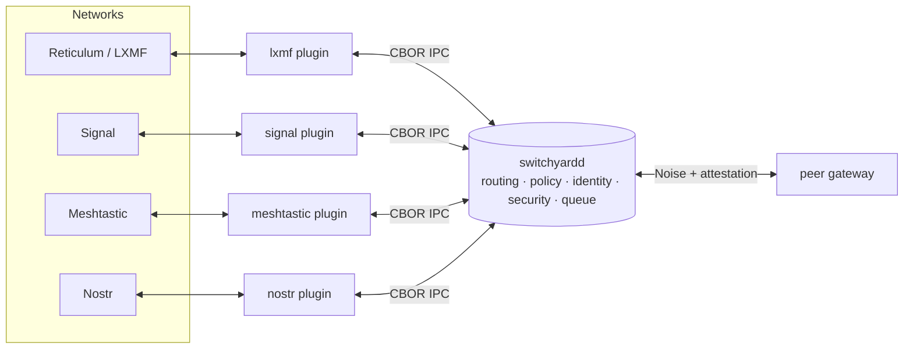

# RelayFabric

**RelayFabric is an open communications routing fabric for interconnecting otherwise incompatible messaging, mesh, radio, and Internet systems.** It provides one common routing, policy, identity, security, and message-processing layer, and delegates every protocol-specific detail to plugins. Bridge a Meshtastic LoRa mesh to Reticulum/LXMF, relay Signal into Nostr, or federate two gateways over an untrusted link — through a single headless daemon.

!!! note "Status — v0.3"
    Shipping: the core fabric (routing, dedup, policy, persistence, admin API), plugins for Reticulum/LXMF, Signal, Meshtastic, MeshCore, Nostr, Bitchat, and MQTT, inter-gateway **federation** with signed attestations, **RFDP** discovery, a documented admin API with Swagger UI, **sealed (blind) routing** ([§113](SPEC.md) — zero-knowledge payload routing, *not* traffic anonymity), and **transport-class-aware egress** (constrained links degrade gracefully). See the [Specification](SPEC.md) for the authoritative detail.

## The idea

Every messaging network speaks its own protocol, carries its own identity model, and makes its own trust assumptions. RelayFabric refuses to reinvent any of them. Instead it routes **messages, not identities**, across a boundary you control:



Plugins are separate, supervised processes that speak a small CBOR-over-Unix-socket protocol to the daemon. The daemon owns routing, deduplication, hop limits, store-and-forward queuing, identity pseudonymization, and the security envelope. A plugin crash never takes the fabric down.

## What it does

| Capability | Summary |
|---|---|
| **Protocol bridging** | One route can span Reticulum, Signal, Meshtastic, MeshCore, Nostr, Bitchat, and MQTT. See [Plugins](plugins.md). |
| **Capability-aware transforms** | Messages are adapted to each destination's real capabilities — text, attachments, media — at egress. See [Architecture](architecture.md). |
| **Transport-class routing** | Egress degrades to the *link's* characteristics: payload capped, images demoted to a note on constrained transports. See [Transport Classes](transport-classes.md). |
| **Identity privacy** | Anonymous, route-scoped pseudonymous, or verified-linked identities. See [Identity & Privacy](identity.md). |
| **Sealed routing** | Blind, gateway-to-gateway end-to-end encryption of the payload. See [Security & Sealed Routing](security.md). |
| **Federation** | switchyardd ↔ switchyardd over Noise-authenticated links with signed attestation chains and RFDP discovery. See [Federation & Discovery](federation.md). |
| **Store-and-forward** | Persistent queue with retry, backoff, TTL, and a dead-letter queue. See [Routing & Policy](routing.md). |
| **Operable** | Unix-socket admin API, `switchyardctl`, Prometheus metrics, hot config reload, Swagger UI. See [Operations](operations.md). |

## Components

- **`switchyardd`** — the core daemon: routing, deduplication, policy enforcement, persistence, and an admin API, all headless.
- **`switchyardctl`** — a CLI client for the admin API (status, plugins, routes, queue, trace, config, events).
- **Plugins** — one supervised process per protocol, speaking CBOR over a Unix socket.

## Get started

```bash
cargo build -j2 --release          # binaries in target/release/
switchyardd --config docs/relayfabric.example.yaml --check-config
```

Then follow [Getting Started](getting-started.md) for a full end-to-end route, or jump to the [Configuration](configuration.md) reference.

!!! warning "Honest claims"
    RelayFabric is scrupulous about what it does *not* provide. Sealed routing hides payloads from intermediary gateways but **not** the metadata of who is talking to whom; pseudonyms provide cross-route unlinkability, **not** anonymity from the gateway operator. Each page states its guarantees — and their limits — plainly.
