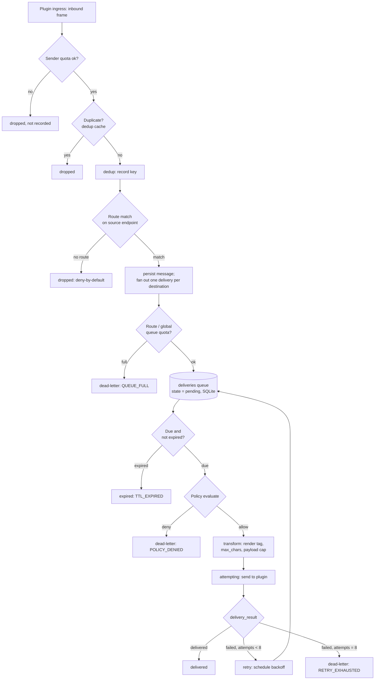

# Routing & Policy

`switchyardd` moves canonical messages between plugins according to
**routes** (which sources feed which destinations), evaluates **policy**
(what's allowed to cross, and how it's shaped) at the point of egress, and
buffers anything that can't be delivered immediately in a persistent
**store-and-forward queue** with backoff, TTL, and a dead-letter tier. This
page covers all three, plus the loop-prevention and deduplication machinery
that keeps a multi-source, multi-destination fabric from echoing messages
back on themselves.

!!! info "Deny by default"
    No message crosses protocols just because two plugins happen to be
    enabled. A message only fans out if an explicit route names its ingress
    endpoint as a `source` (spec §24, §38). See [Configuration](configuration.md)
    for the full route/policy/limits schema.

## How routes work

A route is a named set of `sources` and `destinations`, each a
`protocol:endpoint` pair:

```yaml
routes:
  - name: pasadena-general
    sources:
      - protocol: reticulum
        endpoint: pasadena
      - protocol: meshtastic
        endpoint: longfast
      - protocol: signal
        endpoint: group:pasadena
    destinations:
      - protocol: reticulum
        endpoint: pasadena
      - protocol: meshtastic
        endpoint: longfast
      - protocol: signal
        endpoint: group:pasadena
```

When a message ingresses from a source plugin, the daemon fans it out to
**every destination on every route whose `sources` list contains that exact
`protocol:endpoint`** — minus the ingress endpoint itself. Route matching in
v0.1 keys on the exact source endpoint; there is no per-route toggle yet to
re-include the origin, so echo suppression is unconditional today (spec §24
allows an explicit override; it isn't wired up).

A route with three sources and three destinations, like the example above,
is really nine directed edges (each of the three sources fans out to the
other two destinations, itself excluded) collapsed into one declaration.

## Route types

The same `sources`/`destinations` shape expresses every topology the spec
names (§25):

| Type | Shape | Example |
|---|---|---|
| One-to-one | 1 source → 1 destination | LXMF user → Signal user |
| One-to-many | 1 source → N destinations | LXMF room → Signal group + MeshCore channel |
| Many-to-one | N sources → 1 destination | MeshCore + Meshtastic + LXMF → Signal emergency room |
| Many-to-many | N sources → N destinations | a shared community channel bridged across every protocol |

## Routing criteria

Spec §26 lists the vocabulary a route *could* match on: source protocol,
source instance, source endpoint, sender, pseudonym, message type, security
mode, priority, destination, content metadata, radio metadata, time of day,
route health, network availability, message size. In v0.1, **route
selection itself** matches only on source `protocol:endpoint` — the fields
shown in the YAML above. The richer per-message criteria (priority, size,
destination protocol, attachment handling) are applied one layer down, by
**policy**, after a route has already selected a destination.

## Policy

Policy rules match on `destination_protocol` and shape what's allowed to
reach it:

```yaml
policies:
  - name: small-payloads
    match:
      destination_protocol: [mqtt]
    rules:
      max_payload: 4096
      drop_kinds: [location]
      attachments: reject
      max_attachment_bytes: 500000
```

Implemented rule fields: `max_payload` (bytes), `drop_kinds` (message kinds
stripped before the destination sees them), `attachments` (`allow` or
`reject`), `max_attachment_bytes`. A `Deny` decision dead-letters the
delivery with reason `POLICY_DENIED` before it ever reaches a plugin; an
`Allow` decision's limits combine with the destination plugin's own
advertised capabilities — the tighter of the two wins. See
[Configuration](configuration.md) for the full policy schema and
[Transport Classes](transport-classes.md) for the separate, link-level caps
that apply on top of this (payload size and media allow/deny by transport
class, e.g. a `meshtastic` link vs. `terrestrial_internet`).

## Rendering at egress

Each route has an optional `render` block, applied during the transform
step that already runs on every send:

```yaml
routes:
  - name: demo
    sources: ["mqtt:chat/a"]
    destinations: ["mqtt:chat/b"]
    render:
      tag: alias
      max_chars: 900
```

| Field | Values | Effect |
|---|---|---|
| `tag` | `alias` (default) \| `none` | `alias` prefixes the body with the sender's per-route pseudonym, or — under `identity_mode: linked` with a verified link — that link's `display_name`. `none` suppresses the prefix entirely, including a linked display name. |
| `max_chars` | `0` (disabled) or `>= 16` | Truncates the message **body** to that many Unicode characters, ellipsis appended at the boundary. The tag is never counted or shortened by this, even a long linked display name. |

The transport's own byte cap (`max_payload`, from policy and/or transport
class) still applies afterward as the hard floor — and unlike `max_chars`,
it *may* truncate into the tag.

## Loop prevention and deduplication

Every accepted message is checked against an in-memory **deduplication
cache** before it's recorded or routed. The key is a SHA-256 hash of:

```text
protocol | native_sender | endpoint | timestamp | body | sorted(attachment_sha256s)
```

Attachment hashes are sorted before hashing so the same set of attachments
resent in a different order still dedups against the original. Checking is
a pure peek — a message that fails the sender rate limit is never recorded
as seen, so a legitimate retransmission after the rate-limit window rolls
over isn't silently swallowed.

- **Dedup TTL** is configurable (`dedup_ttl_secs`, default `86400` — 24h in
  the example config) and applies per-entry: tightening the TTL via
  hot-reload only affects entries recorded *after* the change.
- **Loop prevention proper** is the combination of deny-by-default routing
  (a message can only travel edges an operator explicitly configured) and
  unconditional origin exclusion (a route never echoes back to its own
  ingress endpoint). Together with dedup, a message reflected back into the
  fabric by a downstream network is caught as a duplicate rather than
  re-fanned-out.

!!! warning "Dedup does not survive a restart"
    The cache is in-memory only. A daemon restart forgets everything it
    had seen; a message replayed in the window right after restart will
    not be caught as a duplicate. The persistent parts of the pipeline are
    the message/delivery rows themselves (see [Persistence](#persistence)
    below), not the dedup cache.

## Hop limit

Every envelope carries `hop_count`/`hop_limit`, defaulting to `hop_limit:
8` at the node level and independent of any radio-layer hop limit a
protocol like Meshtastic enforces on its own (spec §29). Federation has its
own, separate ceiling — `federation.max_hops` (`4` in the example config)
— checked on inbound federated envelopes; a message at or over that limit
is dead-lettered with reason `HOP_LIMIT` rather than forwarded further.

## Message priority

Five classes, ranked in scheduling order (`0` first):

| Class | Rank |
|---|---|
| `emergency` | 0 |
| `high` | 1 |
| `normal` (default) | 2 |
| `bulk` | 3 |
| `background` | 4 |

An unrecognized or missing class name folds to `normal` (rank 2); class
names are case-sensitive, not fuzzy-matched (`"EMERGENCY"` is not
`"emergency"`). The due-delivery query orders `priority ASC, next_attempt
ASC` — an emergency message queued after a backlog of bulk traffic is still
scheduled first. Locally-originated `emergency` sends also bypass the
per-transport rate budget at egress (never over federation, and a federated
peer cannot forge `emergency` to claim that bypass — inbound federated
priority is reset to the default rank); see
[Transport Classes](transport-classes.md) for the budget mechanics.

## Store-and-forward queue

Anything that can't be delivered immediately becomes a **delivery** row:

```text
message_id     route          destination
priority       attempt_count  next_attempt
created_at     expires_at     state
```

### States

```text
pending → attempting → delivered
                     ↘ retry (→ pending) → … → dead-letter
pending → expired          (TTL passed before an attempt)
pending → dead-letter       (policy denial, queue full, exhausted retries, …)
```

### Persistence

Messages and deliveries are stored in SQLite (`relayfabric.db`, spec §50) —
the queue survives a daemon restart; a `pending` delivery is picked up on
the next scheduler tick exactly as if the restart hadn't happened. This is
distinct from the dedup cache above, which does not survive a restart.

### Retry and backoff

`MAX_ATTEMPTS = 8`. After each failed attempt, the next retry is scheduled
with growing backoff, capped at one hour:

| Failed attempt # | Next retry delay |
|---|---|
| 1 | 5s |
| 2 | 30s |
| 3 | 2m |
| 4 | 10m |
| 5, 6, 7 | 1h (repeats) |
| 8 (`MAX_ATTEMPTS`) | none — dead-lettered (`RETRY_EXHAUSTED`) |

That's up to eight real delivery attempts, spread over roughly three hours,
before a message is given up on. Radio transports may need a different
policy entirely (spec §42) — this schedule is the daemon-wide default, not
a per-protocol one.

### Expiration

Every message carries a TTL; `ttl_default_secs` (default `86400` — 24h) is
the daemon-wide knob in v0.1. The spec sketches per-message-kind TTLs
(`emergency: 6h`, `telemetry: 10m`, spec §43) as a future refinement — only
the single global default is implemented today. A delivery whose `expires_at`
has passed by the time it's picked up is marked `expired` (reason
`TTL_EXPIRED`) and is never sent, regardless of how many attempts remain.

### Dead-letter queue

A dead-lettered delivery is permanent — v0.1 has no automatic or
admin-triggered replay. Reason codes actually emitted include:

| Reason | Meaning |
|---|---|
| `POLICY_DENIED` | A policy rule rejected the message for this destination. |
| `DESTINATION_UNKNOWN` | The underlying message row is gone (e.g. purged) by the time the delivery came due. |
| `TTL_EXPIRED` | The message's TTL passed; state is `expired`, not `dead-letter`, but it's a terminal non-delivery either way. |
| `HOP_LIMIT` | A federated envelope arrived at or over the peer's hop ceiling. |
| `QUEUE_FULL` | Per-route or global queue quota was already at capacity at fan-out time. |
| `RETRY_EXHAUSTED` | `attempt_count` reached `MAX_ATTEMPTS` without a successful delivery. |
| `ROUTE_CONFIG_MISSING`, `NOT_DIRECT_CAPABLE`, `NO_SEALED_KEY`, `ROUTE_NOT_FEDERATED` | Destination-specific preconditions the delivery couldn't meet. |

`GET /v1/queue?state=dead_letter` lists dead-lettered rows for inspection;
see [Operations](operations.md) for the admin API and how to monitor queue
depth/DLQ growth in practice.

### Backpressure

Bounded queues, not unbounded ones: `limits.per_route.queue_max` and
`limits.global.queue_max` (both default to `0`, meaning unlimited) cap how
many pending deliveries a route or the whole daemon may hold. A delivery
that would exceed either quota is dead-lettered with `QUEUE_FULL` at
fan-out time rather than accepted and dropped later. Per-sender rate limits
and a CAS byte budget for attachments (`limits.global.cas_max_bytes`)
apply earlier, at ingress. See [Configuration](configuration.md) for the
full `limits:` block.

## Pipeline at a glance



## Honest semantics

!!! warning "At-least-once, not exactly-once"
    RelayFabric is a store-and-forward relay, not a transactional message
    bus. `delivered: true` from a plugin is terminal on the daemon side —
    it stops retrying — but the daemon cannot detect a plugin that reports
    failure after actually delivering, and a retried delivery may reach the
    destination network more than once. The system does not fabricate
    delivery guarantees a protocol doesn't actually provide (spec §70): not
    every destination supports acknowledgment, and none of this substitutes
    for end-to-end confirmation where a protocol offers one.

- A fan-out send to multiple native recipients (e.g. an LXMF channel's
  members) reports **at-least-one** semantics: `delivered: true` as soon as
  any recipient succeeds, with individual failures folded into a free-text
  `detail` string rather than retried per-recipient.
- Duplicate suppression on the *destination* network (if the destination
  protocol offers any) is that plugin's own concern — the fabric's dedup
  cache only protects against loops and retransmits within RelayFabric
  itself, and only for the configured TTL, and only since the last restart.
- A dead-lettered message is not silently retried by anything — it sits in
  the DLQ until an operator investigates. There is no queue-flush or
  automatic replay button in v0.1.

## See also

- [Configuration](configuration.md) — full `routes:`, `policies:`,
  `limits:`, and TTL/hop-limit/dedup-TTL schema.
- [Transport Classes](transport-classes.md) — link-level payload caps and
  media policy applied on top of route/policy limits at egress.
- [Operations](operations.md) — the admin API's `/v1/queue` surface,
  metrics, and what to watch for DLQ growth or queue backpressure.
